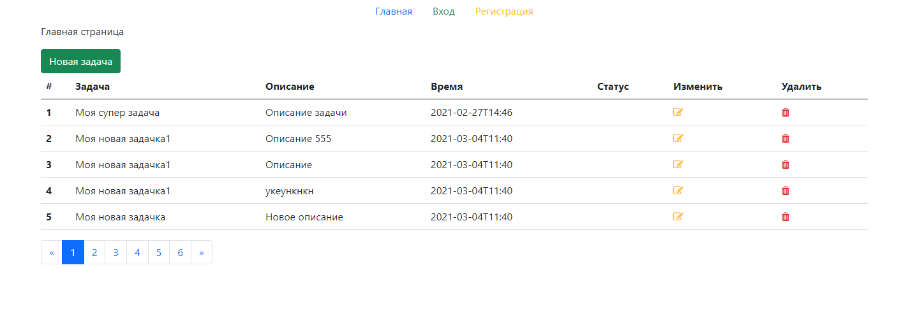

# php-mvc

* Автора: David Amirkhanov (@websofter) https://wsofter.ru
* Видео: https://youtu.be/WraFsev5_oQ
# Запуск через docker

### Запускаем docker-compose
`
$ docker-compose up -d
`
### Данные для MySQL
*  - MYSQL_ROOT_PASSWORD=secret
*  - MYSQL_DATABASE=db
*  - MYSQL_USER=admin
*  - MYSQL_PASSWORD=secret
*  - PORT = 13306

### Данные для Adminer
*   - MySQL = данные выше
*   - HOST = php_mvc_mysql_1 или localhost

Также нужно импортирвоать БД *db.sql*
# Запуск на хостинге

Для запуска на хостинге илли через OpenServer потребуется поменять настройки в * config/db * и импортировать базу данных *db.sql*